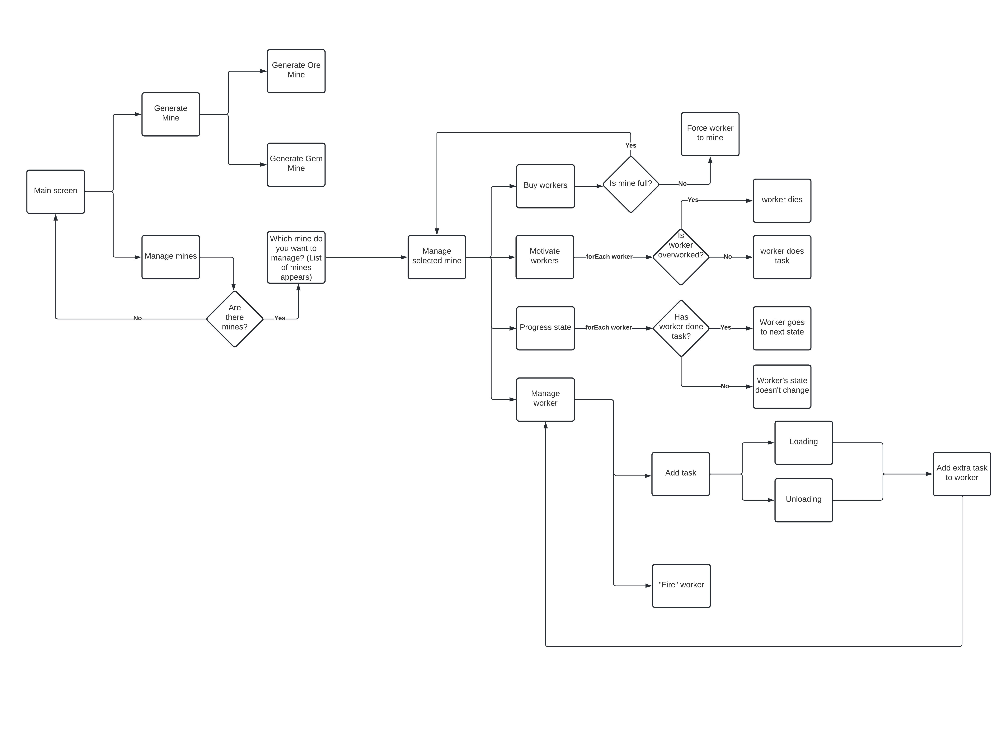
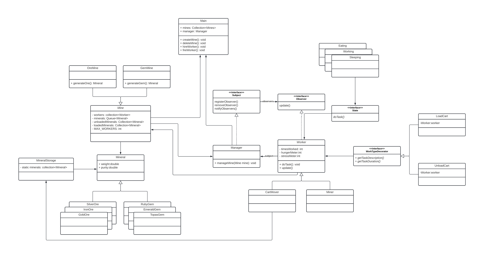
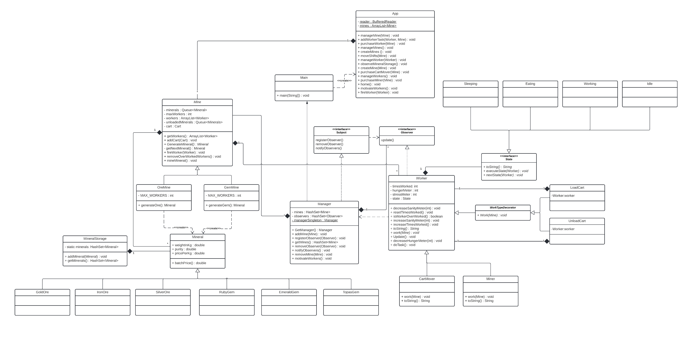

# Design Patterns Final Assignment
___

### Made by:
- Chris Takacs
- Costandino Hiripis
- Steffen Tourbier

## Introduction

The purpose of the final assignment is to create an application that combines at least 4 types 
of design patterns. In this assignment the following patterns are used:
- Factory
- State
- Observer
- Decorator
- (Singleton)

The application that the team decided to make is a small CLI application that utilizes the aforementioned patterns.
 The application is not made to be useful, instead it only serves to demonstrate
that the team is able to create a program in Java that makes use of these patterns. 

## App description

This is a small ""game"" where the user can manage his mines. The user acts as a manager that can open mines,
hire workers and extract gems and ores. Each worker has a tiredness, hunger, and times worked meter. If one of them exceeds a certain threshold the miner ""retires"".
The manager can hire miners or cart movers. Once the cart is full it has to be moved to the mineral storage to be emptied. 
Each worker can take on extra tasks.

## Flowchart

## Initial class diagram

## Final class diagram

